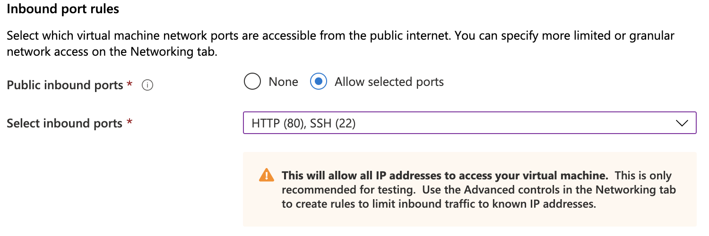
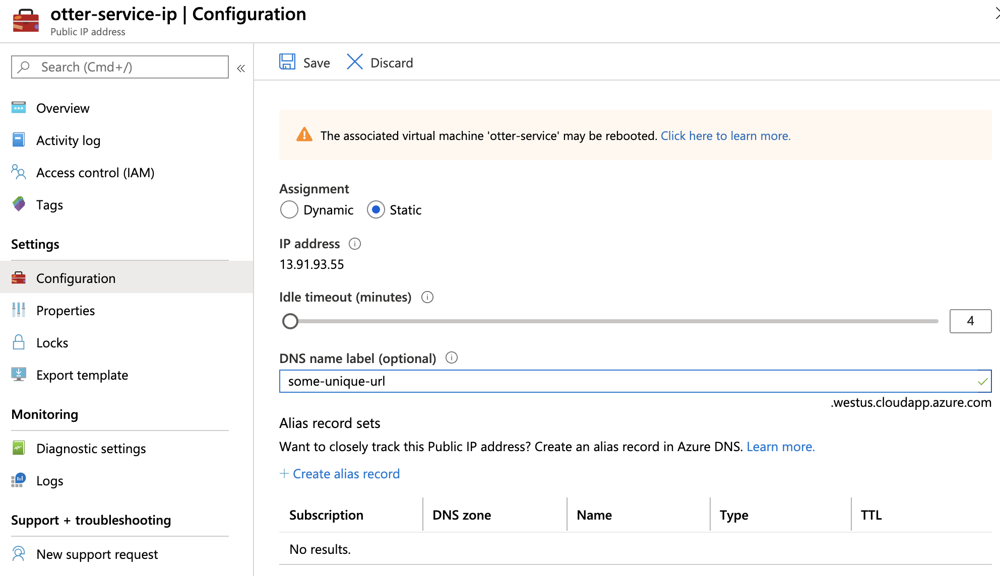
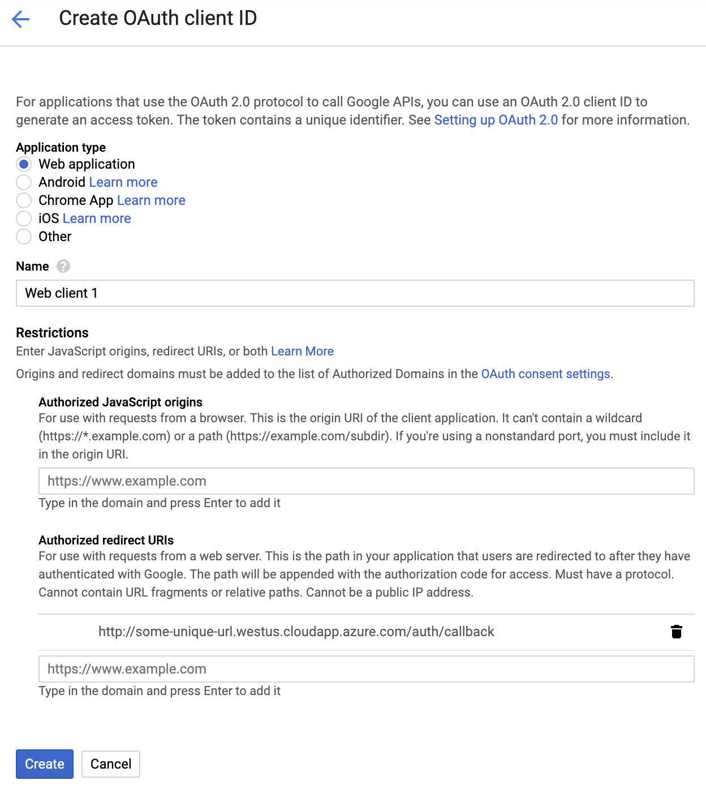

# Deploying a Grading Service

This section describes how to deploy an Otter Service instance. For more information on how to use an already-deployed service, see [Grading on a Deployed Service](otter_service.md).

## VM Requirements

Otter Service instances can be deployed as virtual machines on the cloud provider of your choice. We recommend using Debian as the OS on your VM. To use Otter Service, the VM requires the following to be installed:

* Postgres
* Python 3.6+ (and pip3)
* Docker
* [Otter's Python requirements](https://github.com/ucbds-infra/otter-grader/blob/master/requirements.txt)

Once you have installed the necessary requirements, you need to create a Postgres user that Otter can use to interact with the database. We recommend, and Otter defaults to, the username `root` with password `root`. 

```
sudo -u postgres bash
createuser -dP root       # enter password 'root' when prompted
```

Now that there is a `root` user, the database can be created:

```
sudo -E otter service create
```

`otter service create` creates the Postgres database `otter_db`, if it does not already exist, with the following relations:

```sql
CREATE TABLE users (
    user_id SERIAL PRIMARY KEY,
    api_keys VARCHAR[] CHECK (cardinality(api_keys) > 0),
    username TEXT UNIQUE,
    password VARCHAR,
    email TEXT UNIQUE,
    CONSTRAINT has_username_or_email CHECK (username IS NOT NULL or email IS NOT NULL)
)

CREATE TABLE classes (
    class_id TEXT PRIMARY KEY,
    class_name TEXT NOT NULL
)

CREATE TABLE assignments (
    assignment_id TEXT NOT NULL,
    class_id TEXT REFERENCES classes (class_id) NOT NULL,
    assignment_name TEXT NOT NULL,
    seed INTEGER,
    PRIMARY KEY (assignment_id, class_id)
)

CREATE TABLE submissions (
    submission_id SERIAL PRIMARY KEY,
    assignment_id TEXT NOT NULL,
    class_id TEXT NOT NULL,
    user_id INTEGER REFERENCES users(user_id) NOT NULL,
    file_path TEXT NOT NULL,
    timestamp TIMESTAMP NOT NULL,
    score JSONB,
    FOREIGN KEY (assignment_id, class_id) REFERENCES assignments (assignment_id, class_id)
)
```

Now Otter needs a few environment variables set. We recommend that you put this in _your_ `.bashrc` and then call Otter using `sudo -E` to maintain your environment. The environment variables needed are detailed below.

| Variable | Description |
|-----|-----|
| `GOOGLE_CLIENT_KEY` | A client ID from Google for Google OAuth |
| `GOOGLE_CLIENT_SECRET` | A client secret from Google for Google OAuth |
| `OTTER_ENDPOINT` | The base URL of this VM |

This can be done by appending something like the following to `~/.bashrc`:

```bash
export GOOGLE_CLIENT_KEY="someKey1234.apps.googleusercontent.com"
export GOOGLE_CLIENT_SECRET="someSecret5678"
export OTTER_ENDPOINT="http://my-otter-service-instance.westus.cloudapp.azure.com"
```

Finally, the last thing to do is allow inbound traffic on port 80 (or whatever port you pass to the `--port` flag of `otter service start`). This will allow requests to be sent to the VM for grading.

Now that you have set up your VM, you're ready to start [grading with it](otter_service.md).

## Step-by-Step Deployment Instructions

This section provides step-by-step deployment instructions for deploying an Otter Service instance on different cloud providers.

### Azure

To start deploying an Otter Service VM on Azure, first create a resource group and subscription to house your VM. Then create a new VM from the Virtual Machines menu on the Azure portal. We recommend the `Debian 10 "Buster"` image. The recommended size parameters (`Standard D2s v3 2 vcpus, 8 GiB memory`) are good for a smaller course (< 50 students), but you can scale up the memory for larger courses. You should also provide your [SSH public key](https://docs.microsoft.com/en-us/azure/virtual-machines/linux/mac-create-ssh-keys) so that you can SSH into the VM to set it up. You will need the SSH and HTTP ports open so that you can configure the VM and so that it can accept requests.



The other default configuations are fine, so select "Review + Create", double check the details, and click "Create" to create the VM. Once your deployment has finished, you will need to change the public IP address from dynamic to static and secure a DNS name label. To do this, click "Configure" next to **DNS name** on the Overview page.


On this page, set **Assignment** to "Static" and create a DNS name label in the **DNS name label** field for your VM. The latter is very important because Google Cloud will not let you use an IP address when creating your OAuth credentials. Click **Save** at the top to save these changes.



Continue setup by SSHing into the VM from your Terminal (more info on how to do this under **Connect** > **SSH**). Run the following commands to install Postgres, pip3, Docker, and Otter and its Python requirements.

```
sudo apt update
sudo apt-get update
sudo apt install -y postgresql postgresql-client python3-pip git python-psycopg2 libpq-dev nano
sudo apt-get -y install \
        apt-transport-https \
        ca-certificates \
        curl \
        gnupg-agent \
        software-properties-common
curl -fsSL https://download.docker.com/linux/debian/gpg | sudo apt-key add -
sudo apt-get update
sudo apt-get install -y docker-ce docker-ce-cli containerd.io
sudo pip3 install git+https://github.com/ucbds-infra/otter-grader.git@beta
sudo pip3 install -r https://raw.githubusercontent.com/ucbds-infra/otter-grader/beta/requirements.txt
```

Once the above have run successfully, you need to create a Postgres user that Otter can use to create and manage it database. We recommend a user with username `root` and password `root` as these are the values that Otter defaults to.

```
$ sudo -u postgres bash
$ createuser -dP root
Password: 
```

At the `Password:` prompt, type the user password. 

Next, you will need to create a Google Cloud Platform project to use for Google OAuth. Once you have created the project, go to **APIs & Services** > **OAuth consent screen** and create one. You will need to add the DNS name you configured on Azure to the Authorized domains list. Click **Save** then go to **APIs & Services** > **Credentials** and click "+ Create Credentials" a the top and select "OAuth Client ID". Set the application type to "Web application" and add `http://{YOUR DNS NAME}/auth/callback` to the list of authorized redirect URIs. Click "Create".



Google will provide you with a client ID and client secret; copy these down and SSH back into your VM. Use nano (or your preferred text editor) to open `~/.bashrc` and add the following to the end of it, filling in the values with the corresponding values.

```bash
export GOOGLE_CLIENT_KEY="{YOUR GOOGLE CLIENT ID}"
export GOOGLE_CLIENT_SECRET="{YOUR GOOGLE CLIENT SECRET}"
export OTTER_ENDPOINT="{YOUR DNS NAME}"
```

Now `source` your .bashrc file and create the Postgres database for Otter with

```
sudo -E otter service create
```

Congrats, that's all the setup! You're ready to start grading with Otter Service, as described [here](otter_service.md).
