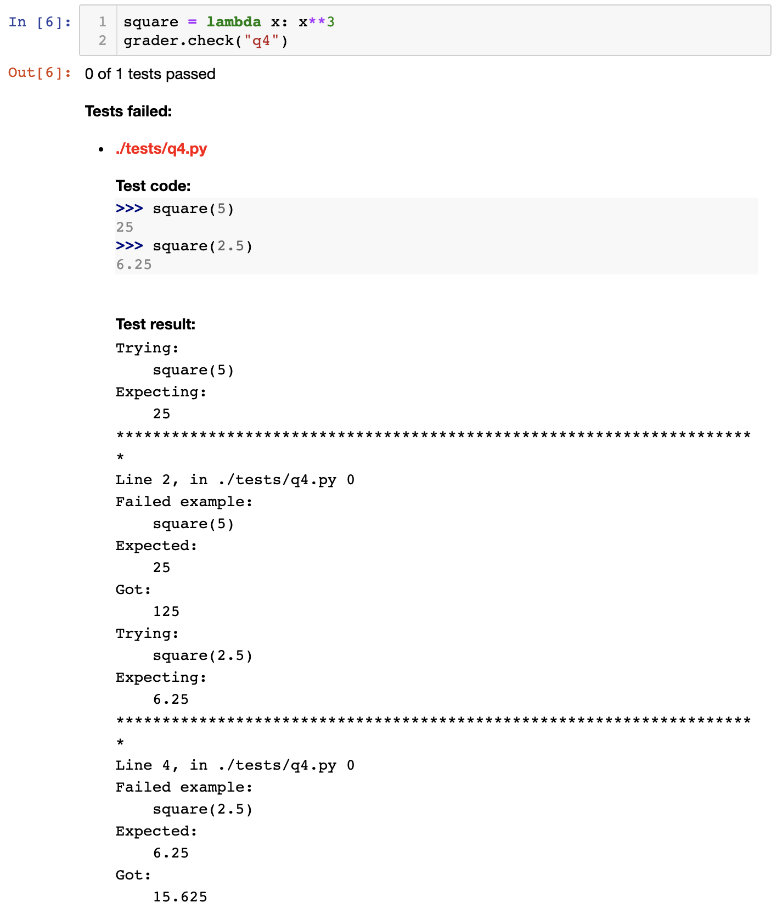

.. _otter_check:

Student Usage
=============

.. toctree::
    :maxdepth: 1
    :hidden:

    dot_otter_files

.. currentmodule:: otter.notebook

Otter provides an IPython API and a command line tool that allow students to run checks and export 
notebooks within the assignment environment.

The ``Notebook`` API
--------------------

Otter supports in-notebook checks so that students can check their progress when working through 
assignments via the ``otter.Notebook`` class. The ``Notebook`` takes one optional parameter that 
corresponds to the path from the current working directory to the directory of tests; the default 
for this path is ``./tests``.

.. code-block:: python

    import otter
    grader = otter.Notebook()

If my tests were in ``./hw00-tests``, then I would instantiate with

.. code-block:: python

    grader = otter.Notebook("hw00-tests")

Students can run tests in the test directory using ``Notebook.check`` which takes in a question 
identifier (the file name without the ``.py`` extension). For example,

.. code-block:: python

    grader.check("q1")

will run the test ``q1.py`` in the tests directory. If a test passes, then the cell displays "All 
tests passed!" If the test fails, then the details of the first failing test are printed out, 
including the test code, expected output, and actual output:

Students can also run all tests in the tests directory at once using ``Notebook.check_all``:

.. code-block:: python

    grader.check_all()

This will rerun all tests against the current global environment and display the results for each 
tests concatenated into a single HTML output. It is recommended that this cell is put at the end of 
a notebook for students to run before they submit so that students can ensure that there are no 
variable name collisions, propagating errors, or other things that would cause the autograder to 
fail a test they should be passing.

Exporting Submissions
+++++++++++++++++++++

Students can also use the ``Notebook`` class to generate a zip file containing all of their work for
submission with the 
method ``Notebook.export``. This function takes an optional argument of the path to the notebook; if 
unspecified, it will infer the path by trying to read the config file (if present), using the path 
of the only notebook in the working directory if there is only one, or it will raise an error 
telling you to provide the path. This method creates a submission zip file that includes the 
notebook file, the log, and, optionally, a PDF of the notebook (set ``pdf=False`` to disable this 
last).

As an example, if I wanted to export ``hw01.ipynb`` with cell filtering, my call would be

.. code-block:: python

    grader.export("hw01.ipynb")

as filtering is by defult on. If I instead wanted no filtering, I would use

.. code-block:: python

    grader.export("hw01.ipynb", filtering=False)

To generate just a PDF of the notebook, use ``Notebook.to_pdf``.

Both of these methods support force-saving the notebook before exporting it, so that any unsaved
changes a student has made to their notebook will be reflected in the exported version. In Python,
this works by using `ipylab` to communicate with the JupyterLab frontend. To use it, set
``force_save=True``:

.. code-block:: python

    grader.export("hw01.ipynb", force_save=True)

In R, you must install the ``ottr_force_save_labextension``
`Python package <https://github.com/chrispyles/ottr-force-save-labextension>`_. This JupyterLab
extension exposes a hook that ``ottr::export`` uses by running JavaScript to save the notebook.

.. code-block:: r

    ottr::export("hw01.ipynb", force_save=TRUE)

Force saving is not supported for Rmd files, and the argument is ignored if used when not running
on Jupyter.

Running on Non-standard Python Environments
+++++++++++++++++++++++++++++++++++++++++++

When running on non-standard Python notebook environments (which use their own interpreters, such as
Colab or Jupyterlite), some Otter features are disabled due differences in file system access, the
unavailability of compatible versions of packages, etc. When you instantiate a ``Notebook``, Otter
automatically to determines if you're running on one of these environments.

Command Line Script Checker
---------------------------

Otter also features a command line tool that allows students to run checks on Python files from the 
command line. ``otter check`` takes one required argument, the path to the file that is being 
checked, and three optional flags:

* ``-t`` is the path to the directory of tests. If left unspecified, it is assumed to be ``./tests``
* ``-q`` is the identifier of a specific question to check (the file name without the ``.py`` 
  extension). If left unspecified, all tests in the tests directory are run.
* ``--seed`` is an optional random seed for :ref:`execution seeding <seeding>`

The recommended file structure for using the checker is something like the one below:

.. code-block::

    hw00
    ├── hw00.py
    └── tests
        ├── q1.py
        └── q2.py  # etc.

After a ``cd`` into ``hw00``, if I wanted to run the test q2.py, I would run

.. code-block:: console

    $ otter check hw00.py -q q2
    All tests passed!

In the example above, I passed all of the tests. If I had failed any of them, I would get an output 
like that below:

.. code-block:: console

    $ otter check hw00.py -q q2
    1 of 2 tests passed

    Tests passed:
        possible 

    Tests failed: 
    *********************************************************************
    Line 2, in tests/q2.py 0
    Failed example:
        1 == 1
    Expected:
        False
    Got:
        True

To run all tests at once, I would run

.. code-block:: console

    $ otter check hw00.py
    Tests passed:
        q1  q3  q4  q5 

    Tests failed: 
    *********************************************************************
    Line 2, in tests/q2.py 0
    Failed example:
        1 == 1
    Expected:
        False
    Got:
        True

As you can see, I passed for of the five tests above, and filed q2.py.

If I instead had the directory structure below (note the new tests directory name)

.. code-block::

    hw00
    ├── hw00.py
    └── hw00-tests
        ├── q1.py
        └── q2.py  # etc.

then all of my commands would be changed by adding ``-t hw00-tests`` to each call. As an example, 
let's rerun all of the tests again:

.. code-block:: console

    $ otter check hw00.py -t hw00-tests
    Tests passed:
        q1  q3  q4  q5 

    Tests failed: 
    *********************************************************************
    Line 2, in hw00-tests/q2.py 0
    Failed example:
        1 == 1
    Expected:
        False
    Got:
        True

``otter.Notebook`` Reference
----------------------------

.. autoclass:: otter.check.notebook.Notebook
    :members:
