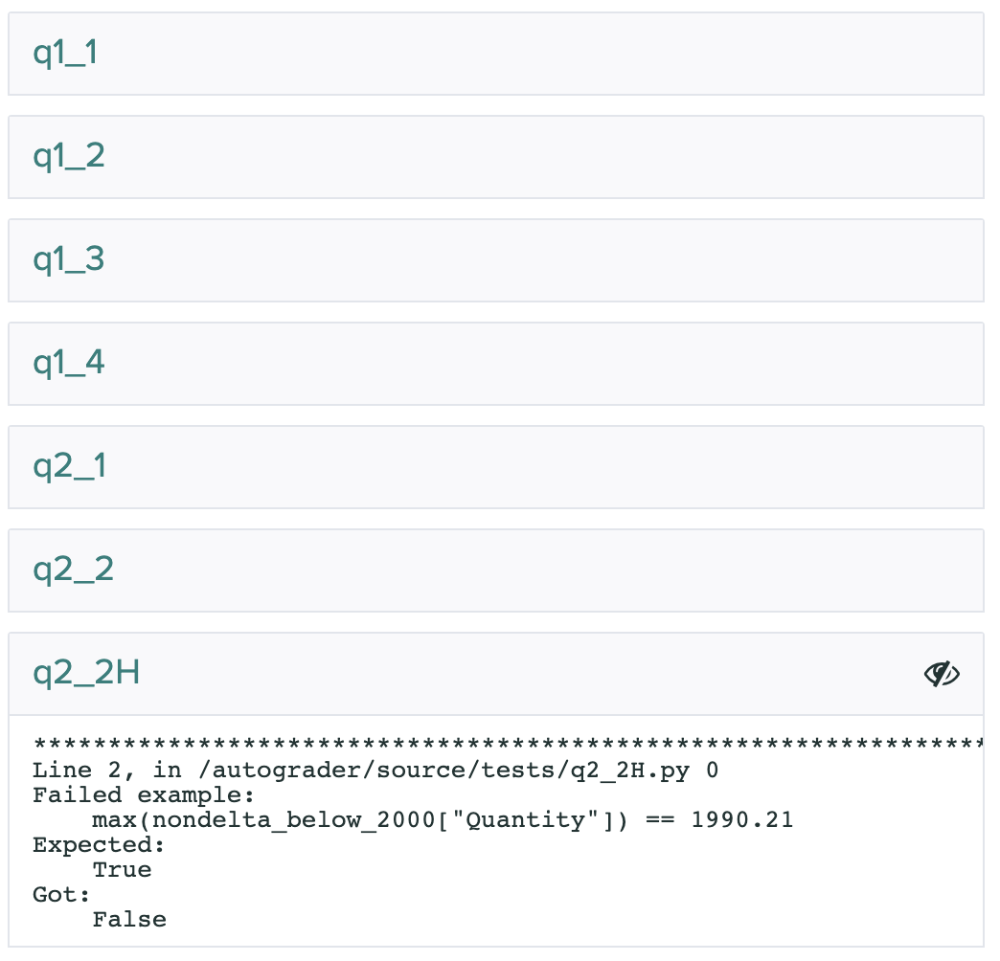
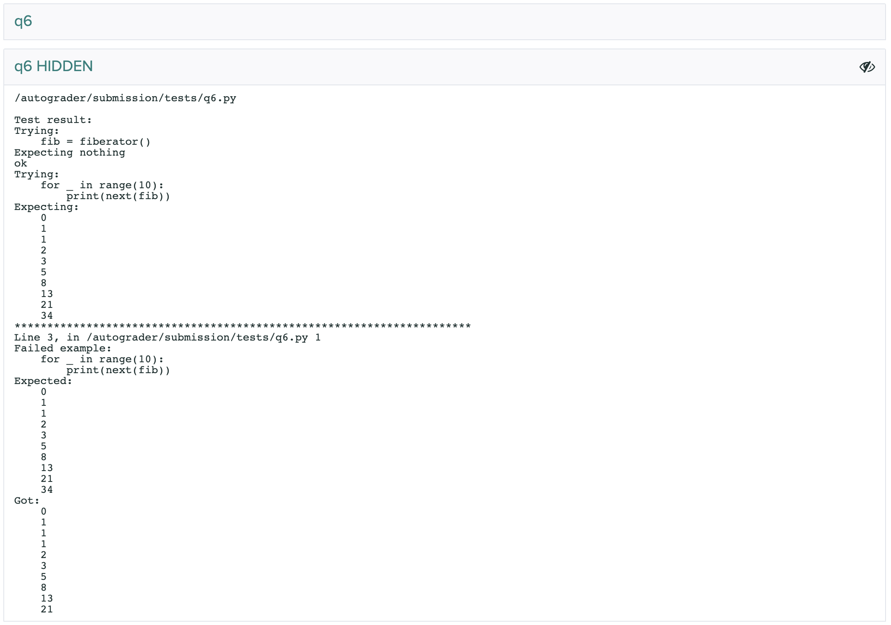

# Grading on Gradescope

Otter-Grader also allows instructors to use Gradescope's autograding system to collect and grade students' submissions. This section assumes that instructors are familiar with Gradescope's interface and know how to set up assignments on Gradescope; for more information on using Gradescope, see their [help pages](https://www.gradescope.com/help#help-center-item-programming-assignments).

## Writing Tests for Gradescope

The tests that are used by the Gradescope autograder are the same as those used in other uses of Otter, but there is one important field that is relevant to Gradescope that is not pertinent to any other uses.

As noted in the second bullet [here](test_files.html#ok-format-caveats), the `"hidden"` key of each test case indicates the visibility of that specific test case. If a student passes all tests, they are shown a successful check. If they pass all public tests but fail hidden tests, they are shown a successful check but a second output is shown below that for instructors only, showing the output of the failed test. If students fail a public test, students are shown the output of the failed test and there is no second box.

For more information on how tests are displayed to students, see [below](#gradescope-results).

## Using the Command Line Generator

To use Otter with Gradescope's autograder, you must first generate a zipfile that you will upload to Gradescope so that they can create a Docker image with which to grade submissions. Otter's command line utility `otter generate` allows instructors to create this zipfile from their machines. It is divided into two subcommands: `autograder` and `token`.

### Before Using Otter Generate

Before using Otter Generate, you should already have written [tests](test_files.md) for the assignment, created a Gradescope autograder assignment, and collected extra requirements into a requirements.txt file (see [here](otter_grade.html#requirements)). (Note: these default requirements can be overwritten by your requirements by passing the `--overwrite-requirements` flag.)

### Directory Structure

For the rest of this page, assume that we have the following directory structure:

```
| hw00-dev
  | - data.csv
  | - hw00-sol.ipynb
  | - hw00.ipynb
  | - requirements.txt
  | - utils.py
  | tests
    | - q1.py
    | - q2.py
    ...
  | hidden-tests
    | - q1.py
    | - q2.py
    ...
```

Also assume that we have `cd`ed into `hw00-dev`.

### Usage

The general usage of `otter generate autograder` is to create a zipfile at some output path (`-o` flag, default `./`) which you will then upload to Gradescope. Otter Generate has a few optional flags, described in the [Otter Generate Reference](#otter-generate-autograder) below.

If you do not specify `-t` or `-o`, then the defaults will be used. If you do not specify `-r`, Otter looks in the working directory for `requirements.txt` and automatically adds it if found; if it is not found, then it is assumed there are no additional requirements. There is also an optional positional argument that goes at the end of the command, `files`, that is a list of any files that are required for the notebook to execute (e.g. data files, Python scripts).

The simplest usage in our example would be

```
otter generate autograder
```

This would create a zipfile with the tests in `./tests` and no extra requirements or files. If we needed `data.csv` in the notebook, our call would instead become

```
otter generate autograder data.csv
```

Note that if we needed the requirements in `requirements.txt`, our call wouldn't change, since Otter automatically found `./requirements.txt`.

Now let's say that we maintained to different directories of tests: `tests` with public versions of tests and `hidden-tests` with hidden versions. Because I want to grade with the hidden tests, my call then becomes

```
otter generate autograder -t hidden-tests data.csv
```

Now let's say that I need some functions defined in `utils.py`; then I would add this to the last part of my Otter Generate call:

```
otter generate autograder -t hidden-tests data.csv utils.py
```

<!-- TODO: update for dummy rows -->
<!-- TODO: update images -->

#### Grading with Environments

Otter can grade assignments using saved environemnts in the log in the Gradescope container. This works by unshelving the environment stored in each check entry of Otter's log and grading against it. The notebook is parsed and only its import statements are executed. For more inforamtion about saving and using environments, see [Logging](logging.md).

To configure this behavior, two things are required:

* the use of the `--grade-from-log` flag when generating an autograder zipfile
* using an [Otter configuration file](dot_otter_files.md) with `save_environments` set to `true`

This will tell Otter to shelve the global environment each time a student calls `Notebook.check` (pruning the environments of old calls each time it is called on the same question). When the assignment is exported using `Notebook.export`, the log file (at `.OTTER_LOG`) is also exported with the global environments. These environments are read in in the Gradescope container and are then used for grading. Because one environment is saved for each check call, variable name collisions can be averted, since each question is graded using the global environment at the time it was checked. Note that any requirements needed for execution need to be installed in the Gradescope container, because Otter's shelving mechanism does not store module objects.

#### Autosubmission of Notebook PDFs

Otter Generate allows instructors to automatically generate PDFs of students' notebooks and upload these as submissions to a separate Gradescope assignment. This requires a Gradescope token, which can be obtained with `otter generate token`. This will ask you to log in to Gradescope with your credentials and will provide you with a token, which can be passed to the `--token` flag of `otter generate autograder` to initialize the generation of PDFs.

```
$ otter generate token
Please provide the email address on your Gradescope account: some_instructor@some_institution.edu
Password: 
Your token is:
 {YOUR TOKEN}
```

Otter Generate also needs the course ID and assignment ID of the assignment to which PDFs should be submitted. This information can be gathered from the assignment URL on Gradescope:

```
https://www.gradescope.com/courses/{COURSE ID}/assignments/{ASSIGNMENT ID}
```

Currently, this action only supports [HTML comment filtering](pdfs.md), but filtering can be turned off with the `--unfiltered-pdfs` flag.

#### Pass/Fail Thresholds

The Gradescope generator supports providing a pass/fail threshold. A threshold is passed as a float between 0 and 1 such that if a student receives at least that percentage of points, they will receive full points as their grade and 0 points otherwise. 

The threshold is specified with the `--threshold` flag:

```
otter generate autograder data.csv --threshold 0.75
```

For example, if a student passes a 2- and 1- point test but fails a 4-point test (a 43%) on a 25% threshold, they will get all 7 points. If they only pass the 1-point test (a 14%), they will get 0 points.

#### Overriding Points Possible

By default, the number of points possible on Gradescope is the sum of the point values of each test. This value can be overrided, however, to some other value using the `--points` flag, which accepts an integer. Then the number of points awarded will be the provided points value scaled by the percentage of points awarded by the autograder.

For example, if a student passes a 2- and 1- point test but fails a 4-point test, they will receive (2 + 1) / (2 + 1 + 4) * 2 = 0.8571 points out of a possible 2 when `--points` is set to 2.

As an example, the command below scales the number of points to 3:

```
otter generate autograder data.csv --points 3
```

#### Public Test Multiplier

You can optionally specify a percentage of the points to award students for passing all of the public tests. This percentage defaults to 0 but this can be changed using the `--public-multiplier` flag:

```
otter generate autograder --public-multiplier 0.5
```

#### Intercell Seeding

The Gradescope autograder supports intercell seeding with the use of the `--seed` flag. Passing it an integer will cause the autograder to seed NumPy and Python's `random` library between *every* pair of code cells. This is useful for writing deterministic hidden tests. More information about Otter seeding [here](seeding.md). As an example, I can set an intercell seed of 42 with

```
otter generate autograder data.csv --seed 42
```

#### Showing Autograder Results

The generator lastly allows intructors to specify whether or not the stdout of the grading process (anything printed to the console by the grader or the notebook) is shown to students. **The stdout includes a summary of the student's test results, including the points earned and possible of public _and_ hidden tests, as well as the visibility of tests as indicated by `test["hidden"]`.** 

This behavior is turned off by default and can be turned on by passing the `--show-stdout` flag to `otter generate autograder`.

```
otter generate autograder data.csv --show-stdout
```

If `--show-stdout` is passed, the stdout will be made available to students _only after grades are published on Gradescope_. The same can be done for hidden test outputs using the `--show-hidden` flag:

```
otter generate autograder --show-hidden
```

The [next section](#gradescope-results) details more about how output on Gradescope is formatted.

#### Generating with Otter Assign

Otter Assign comes with an option to generate this zip file automatically when the distribution notebooks are created via the `--generate` flag. See [Distributing Assignments](otter_assign.md) for more details.

## Gradescope Results

This section details how the autograder runs and how results are displayed to students and instructors on Gradescope. When a student submits to Gradescpe, the autograder does the following:

1. Copies the tests and support files from the autograder source
2. Globs the first IPYNB file and assumes this to be the submission to be graded
3. Corrects instances of `otter.Notebook` for different test paths using a regex
4. Reads in the log from the submission if it exists
5. Grades the notebook, globbing all tests and grading from the log if specified
6. Looks for discrepancies between the logged scores and the autograder scores and warngs about these if present
7. If indicated, exports the notebook to a PDF and POSTs this notebook to the other Gradescope assignment
8. Generates the JSON object for Gradescope's results
9. Makes adjustments to the scores and visibility based on the configurations
10. Writes the JSON to the results file
11. Prints the results as a dataframe to stdout

### Instructor View

Once a student's submission has been autograder, the Autograder Results page will show the stdout of the grading process in the "Autograder Output" box and the student's score in the side bar to the right of the output. The stdout includes a DataFrame that contains the student's score breakdown by question and a summary of the information about test output visibility at the top of this page:


Below the autograder output, each test case is broken down into boxes. If there is no output for the box, then that test was passed. If a test is failed, then the usual test failure output is displayed.



Instructors will be able to see _all_ tests. The visibility of a test to students is indicated to instructors by the  icon (all tests with this icon are hidden to students). As noted earlier, if a student passes all public tests for a question but fails a hidden test, two boxes are shown to the instructor, of which only the first is visibile to the student:



### Student View

On submission, students will only be able to see the results of those test cases for which `test["suites"][0]["cases"][<int>]["hidden"]` evaluates to `True` (see [Test Files](test_files.md) for more info). If `test["suites"][0]["cases"][<int>]["hidden"]` is `False` or not specified, then that test case is hidden.

If `--show-stdout` was specified when constructing the autograder zipfile, then the autograder output from above will be shown to students _after grades are published on Gradescope_. Students will **not** be able to see the results of hidden tests nor the tests themselves, but they will see that they failed some hidden test in the printed DataFrame from the stdout. If `--show-hidden` was passed, students will also see the failed otput of the failed hidden tests.

Note that, because some tests are hidden, students will never see the autograder score in the right sidebar; instead, their score will only show as a dash `-` out of the points possible. Therefore, the only way for students to calculate their autograder score is to use the DataFrame printed to the stdout if `--show-stdout` is passed.

## Otter Generate Reference

### `otter generate autograder`

```eval_rst
.. argparse::
   :module: otter.argparser
   :func: get_parser
   :prog: otter
   :path: generate autograder
   :nodefaultconst:
```

### `otter generate token`

```eval_rst
.. argparse::
   :module: otter.argparser
   :func: get_parser
   :prog: otter
   :path: generate token
   :nodefaultconst:
```
