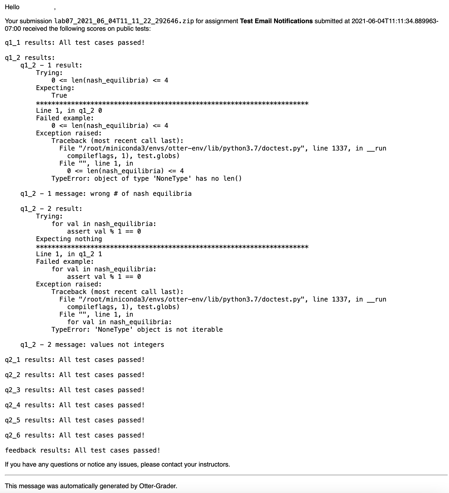

Gmail Notifications
===================

This plugin sends students an email summary of the results of their public test cases using the 
Gmail API. To use this plugin, you must set up a Google Cloud project and create an OAuth2 Client 
that can be used as a proxy for another email address.

Setup
-----

Before using this plugin, you must first create Google OAuth2 credentials on a Google Cloud project. 
Using these credentials, you must then obtain a refresh token that connects these credentials to the 
account from which you want to send the emails. Once you have the credentials, use the 
``gmail_oauth2`` CLI included with Otter to generate the refresh token. Use the command below to 
perform this action, substituting in your credentials client ID and secret.

.. code-block:: console

    gmail_oauth2 --generate_oauth2_token --client_id="<client_id>" --client_secret="<client_secret>" --scope="https://www.googleapis.com/auth/gmail.send"

This command will prompt you to visit a URL and authenticate with Google, which will then provide 
you with a verification code that you should enter back in the CLI. You will then be provided with 
your refresh token.

Configuration
-------------

This plugin requires four configurations: the Google client ID, client secret, refresh token, and 
the email address from which emails are being sent (the same one used to authenticate for the 
refresh token).

.. code-block:: yaml

    plugins:
        - otter.plugins.builtin.GmailNotifications:
            client_id: client_id-1234567.apps.googleusercontent.com
            client_secret: abc123
            refresh_token: 1//abc123
            email: course@univ.edu

Optionally, this plugin also accepts a ``catch_api_error`` configuration, which is a boolean 
indicating whether Google API errors should be ignored.

Output
------

The email sent to students uses the following jinja2 template:

.. code-block:: html

    
Hello {{ student_name }},

    
Your submission <code>{{ zip_name }}</code> for assignment 
    <strong>{{ assignment_title }}</strong> submitted at {{ submission_timestamp }} received the 
    following scores on public tests:

    <pre>{{ score_report }}</pre>

    
If you have any questions or notice any issues, please contact your instructors.

    

    
This message was automatically generated by Otter-Grader.

The resulting email looks like this:

Note that the report only includes the results of **public** tests.

``otter.plugins.builtin.GmailNotifications`` Reference
------------------------------------------------------

.. autoclass:: otter.plugins.builtin.GmailNotifications
    :members:
