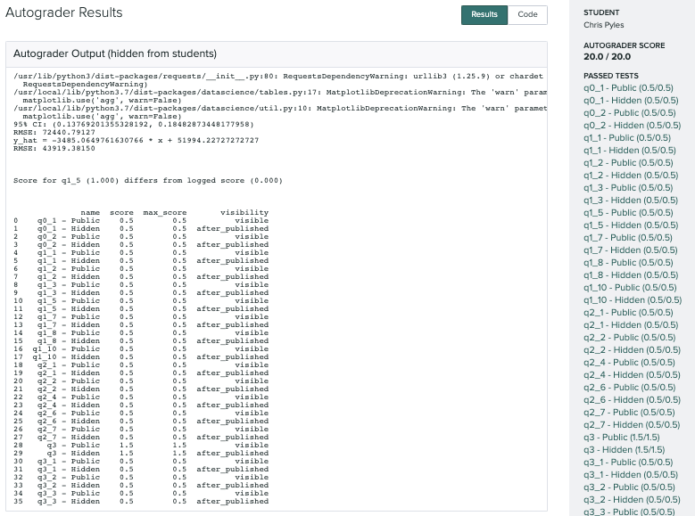
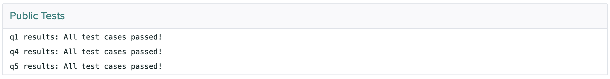
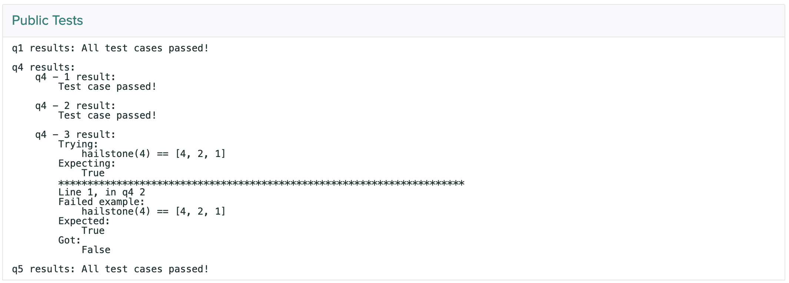
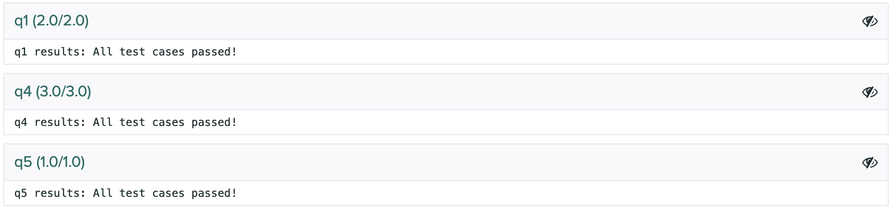
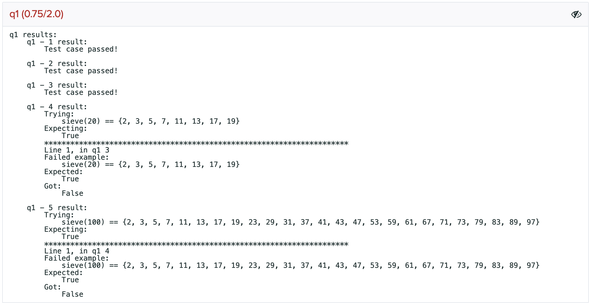

.. role:: inline-html(raw)
    :format: html

.. _workflow_executing_submissions_gradescope:

Grading on Gradescope
=====================

This section describes how results are displayed to students and instructors on Gradescope.

Writing Tests for Gradescope
----------------------------

The tests that are used by the Gradescope autograder are the same as those used in other uses of 
Otter, but there is one important field that is relevant to Gradescope that is not pertinent to any 
other uses.

As noted in the second bullet :ref:`here <test_files_ok_format_caveats>`, the ``"hidden"`` 
key of each test case indicates the visibility of that specific test case.

Results
-------

Once a student's submission has been autograded, the Autograder Results page will show the stdout of 
the grading process in the "Autograder Output" box and the student's score in the side bar to the 
right of the output. The stdout includes information from verifying the student's scores against the 
logged scores, a dataframe that contains the student's score breakdown by question, and a summary of 
the information about test output visibility:

If ``show_stdout`` was true in your ``otter_config.json``, then the autograder 
output will be shown to students *after grades are published on Gradescope*. Students 
will **not** be able to see the results of hidden tests nor the tests themselves, but they will see 
that they failed some hidden test in the printed DataFrame from the stdout.

Below the autograder output, each test case is broken down into boxes. The first box is called
"Public Tests" and summarizes the results of the *public* test cases only. This box is visible to 
students. If a student fails a hidden test but no public tests, then this box will show "All tests
passed" for that question, even though the student failed a hidden test.

If the student fails a public test, then the output of the failed public test will be displayed here,
but no information about hidden tests will be included. In the example below, the student failed a
hidden test case in ``q1`` and a public test case in ``q4``.

Below the "Public Tests" box will be boxes for each question. These are hidden from the student
unless ``show_hidden`` was true in your ``otter_config.json``; if that is the case, then they will
become visible to students after grades are published. These boxes show the results for each question,
*including the results of hidden test cases*.

If all tests cases are passed, these boxes will indicate so:

If the studen fails any test cases, that information will be presented here. In the example below,
``q1 - 4`` and ``q1 - 5`` were hidden test cases; this screenshot corresponds to the second "Public
Tests" section screenshot above.

