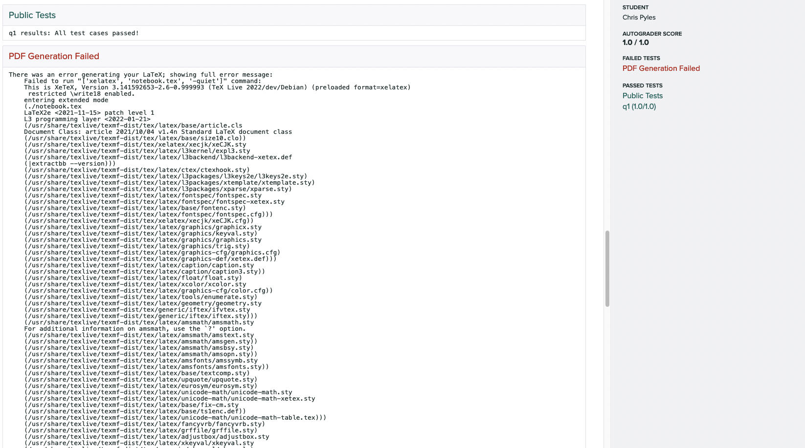

.. _workflow_otter_generate:

Generating Configuration Files
==============================

.. toctree::
    :maxdepth: 1
    :hidden:

    container_image

This section details how to generate the configuration files needed for preparing Otter autograders. 
Note that this step can be accomplished automatically if you're using :ref:`Otter Assign 
<otter_assign>`.

To use Otter to autograde an assignment, you must first generate a zip file that Otter will use to 
create a Docker image with which to grade submissions. Otter's command line utility 
``otter generate`` allows instructors to create this zip file from their machines.

Before Using Otter Generate
---------------------------

Before using Otter Generate, you should already have written :ref:`tests <test_files>` 
for the assignment and collected extra requirements into a requirements.txt file (see :ref:`here 
<workflow_otter_generate_container_image>`). (Note: the default requirements can be overwritten by 
your requirements by passing the ``--overwrite-requirements`` flag.)

Directory Structure
-------------------

For the rest of this page, assume that we have the following directory structure:

.. code-block::

    hw00-dev
    ├── data.csv
    ├── hidden-tests
    │   ├── q1.py
    │   └── q2.py  # etc.
    ├── hw00-sol.ipynb
    ├── hw00.ipynb
    ├── requirements.txt
    ├── tests
    │   ├── q1.py
    │   └── q2.py  # etc.
    └── utils.py

Also assume that the working directory is ``hw00-dev``.

Usage
-----

The general usage of ``otter generate`` is to create a zip file at some output directory (``-o`` 
flag, default ``./``) which you will then use to create the grading image. Otter Generate has a few 
optional flags, described in the :ref:`cli_reference`.

If you do not specify ``-t`` or ``-o``, then the defaults will be used. If you do not specify 
``-r``, Otter looks in the working directory for ``requirements.txt`` and automatically adds it if 
found; if it is not found, then it is assumed there are no additional requirements. If you do not 
specify ``-e``, Otter will use the default ``environment.yml``. There is also an optional positional 
argument that goes at the end of the command, ``files``, that is a list of any files that are 
required for the notebook to execute (e.g. data files, Python scripts). To autograde an R 
assignment, pass the ``-l r`` flag to indicate that the language of the assignment is R.

The simplest usage in our example would be

.. code-block:: console

    otter generate

This would create a zip file ``autograder.zip`` with the tests in ``./tests`` and no extra 
requirements or files. If we needed ``data.csv`` in the notebook, our call would instead become

.. code-block:: console

    otter generate data.csv

Note that if we needed the requirements in ``requirements.txt``, our call wouldn't change, since 
Otter automatically found ``./requirements.txt``.

Now let's say that we maintained to different directories of tests: ``tests`` with public versions 
of tests and ``hidden-tests`` with hidden versions. Because I want to grade with the hidden tests, 
my call then becomes

.. code-block:: console

    otter generate -t hidden-tests data.csv

Now let's say that I need some functions defined in ``utils.py``; then I would add this to the last 
part of my Otter Generate call:

.. code-block:: console

    otter generate -t hidden-tests data.csv utils.py

If this was instead an R assignment, I would run

.. code-block:: console

    otter generate -t hidden-tests -l r data.csv

Grading Configurations
----------------------

There are several configurable behaviors that Otter supports during grading. Each has default 
values, but these can be configured by creating an Otter config JSON file and passing the path to 
this file to the ``-c`` flag (``./otter_config.json`` is automatically added if found and ``-c`` is 
unspecified).

The supported keys and their default values are configured in a fica_ configuration class
(``otter.run.run_autograder.autograder_config.AutograderConfig``). The available configurations are
documented below.

.. _fica: https://fica.readthedocs.io/

.. fica:: otter.run.run_autograder.autograder_config.AutograderConfig
    :format: json

Grading with Environments
+++++++++++++++++++++++++

Otter can grade assignments using saved environments in the log in the Gradescope container. *This 
behavior is not supported for R assignments.* This works by deserializing the environment stored in 
each check entry of Otter's log and grading against it. The notebook is parsed and only its import 
statements are executed. For more inforamtion about saving and using environments, see 
:ref:`logging`.

To configure this behavior, two things are required:

* the use of the ``grade_from_log`` key in your config JSON file
* providing studens with an :ref:`Otter configuration file <otter_check_dot_otter_files>` that 
  has ``save_environments`` set to ``true``

This will tell Otter to shelve the global environment each time a student calls ``Notebook.check`` 
(pruning the environments of old calls each time it is called on the same question). When the 
assignment is exported using ``Notebook.export``, the log file (at ``./.OTTER_LOG``) is also 
exported with the global environments. These environments are read in in the Gradescope container 
and are then used for grading. Because one environment is saved for each check call, variable name 
collisions can be averted, since each question is graded using the global environment at the time 
it was checked. Note that any requirements needed for execution need to be installed in the 
Gradescope container, because Otter's shelving mechanism does not store module objects.

Autosubmission of Notebook PDFs
+++++++++++++++++++++++++++++++

Otter Generate allows instructors to automatically generate PDFs of students' notebooks and upload
these as submissions to a separate Gradescope assignment. This requires a Gradescope token or
entering your Gradescope account credentials when prompted (for details see
:ref: `the notebook metadata section <otter_assign_v1_assignment_metadata>`).
Otter Generate also needs the course ID and assignment ID of the assignment to which PDFs should
be submitted—a separate assignment from your autograder assignment of type "Homework / Problem Set."
This information can be gathered from the assignment URL on Gradescope:

.. code-block::

    https://www.gradescope.com/courses/{COURSE ID}/assignments/{ASSIGNMENT ID}

To configure this behavior, set the ``course_id`` and ``assignment_id`` configurations in your 
config JSON file. When Otter Generate is run, you will be prompted to enter your Gradescope email 
and password. Alternatively, you can provide these via the command-line with the ``--username`` and 
``--password`` flags, respectively:

.. code-block::

    otter generate --username someemail@domain.com --password thisisnotasecurepassword

Currently, this action supports :ref:`HTML comment filtering <pdfs>` with pagebreaks, but these 
can be disabled with the ``filtering`` and ``pagebreaks`` keys of your config.

For cases in which the generation or submission of this PDF fails, you can optionally relay this
information to students using the ``warn_missing_pdf`` configuration. If this is set to true, a
0-point failing test case will be displayed to the student with the error thrown while trying to
generate or submit the PDF:

Pass/Fail Thresholds
++++++++++++++++++++

The configuration generator supports providing a pass/fail threshold. A threshold is passed as a 
float between 0 and 1 such that if a student receives at least that percentage of points, they will 
receive full points as their grade and 0 points otherwise. 

The threshold is specified with the ``threshold`` key:

.. code-block:: json

    {
        "threshold": 0.25
    }

For example, if a student passes a 2- and 1- point test but fails a 4-point test (a 43%) on a 25% 
threshold, they will get all 7 points. If they only pass the 1-point test (a 14%), they will get 0 
points.

Overriding Points Possible
++++++++++++++++++++++++++

By default, the number of points possible on Gradescope is the sum of the point values of each test. 
This value can be overrided, however, to some other value using the ``points_possible`` key, which 
accepts an integer. Then the number of points awarded will be the provided points value scaled by 
the percentage of points awarded by the autograder.

For example, if a student passes a 2- and 1- point test but fails a 4-point test, they will receive 
(2 + 1) / (2 + 1 + 4) * 2 = 0.8571 points out of a possible 2 when ``points_possible`` is set to 2.

As an example, the command below scales the number of points to 3:

.. code-block:: json

    {
        "points_possible": 3
    }

Intercell Seeding
+++++++++++++++++

The autograder supports intercell seeding with the use of the ``seed`` key. *This behavior is not 
supported for Rmd and R script assignments, but is supported for R Jupyter notebooks.* Passing it an 
integer will cause the autograder to seed NumPy and Python's ``random`` library or call ``set.seed`` 
in R between *every* pair of code cells. This is useful for writing deterministic hidden tests. More 
information about Otter seeding can be found :ref:`here <seeding>`. As an example, you can set 
an intercell seed of 42 with

.. code-block:: json

    {
        "seed": 42
    }

Showing Autograder Results
++++++++++++++++++++++++++

The generator allows intructors to specify whether or not the stdout of the grading process 
(anything printed to the console by the grader or the notebook) is shown to students. The stdout 
includes a summary of the student's test results, including the points earned and possible of public 
*and* hidden tests, as well as the visibility of tests as indicated by ``test["hidden"]``.

This behavior is turned off by default and can be turned on by setting ``show_stdout`` to ``true``.

.. code-block:: json

    {
        "show_stdout": true
    }

If ``show_stdout`` is passed, the stdout will be made available to students *only after grades are 
published on Gradescope*. The same can be done for hidden test outputs using the ``show_hidden`` 
key.

The :ref:`workflow_executing_submissions_gradescope` section details more 
about how output on Gradescope is formatted. Note that this behavior has no effect on any platform 
besides Gradescope.

Plugins
+++++++

To use plugins during grading, list the plugins and their configurations in the ``plugin``  key of 
your config. If a plugin requires no configurations, it should be listed as a string. If it does, it 
should be listed as a dictionary with a single key, the plugin name, that maps to a subdictionary of 
configurations.

.. code-block:: json

    {
        "plugins": [
            "somepackage.SomeOtterPlugin",
            {
                "somepackage.SomeOtherOtterPlugin": {
                "some_config_key": "some_config_value"
                }
            }
        ]
    }

For more information about Plugins, see :ref:`here <plugins>`.

Generating with Otter Assign
----------------------------

Otter Assign comes with an option to generate this zip file automatically when the distribution 
notebooks are created via the ``generate`` key of the assignment metadata. See :ref:`otter_assign` 
for more details.
